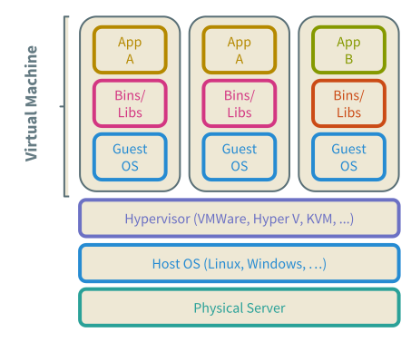
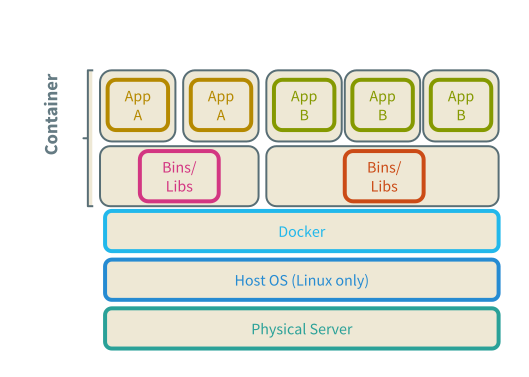
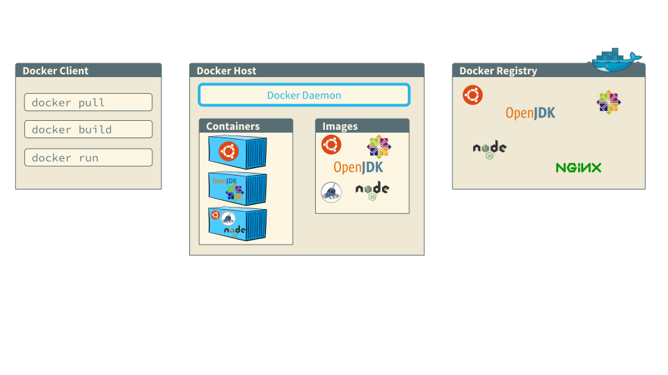
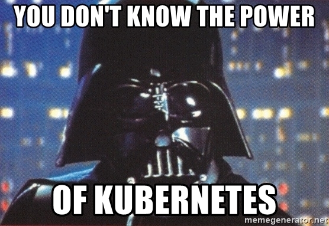

### Themenquerschnitt

> DevOps

> Infrastucture as Code

> Container (Docker)

> Containerplattform (Kubernetes)

---

### Was ist eigentlich „DevOps“?

--

### Was manche sagen ...
* Ops: *„Entwickler die auch Ops machen, aber halt nicht richtig...“*
* Dev: *„Dann müssen wir ja auch noch Ops machen!!1!1“*
* Management: *„Toll, da brauche ich nur noch halb soviel Leute!“*

--

### Definition
*„DevOps is the practice of operations and development engineers participating together in the entire service lifecycle, from design through the development process to production support.“* [🔗](https://theagileadmin.com/what-is-devops/)

--

### Definition

*„DevOps is also characterized by operations staff making use many of the same techniques as developers for their systems work.“* [🔗](https://theagileadmin.com/what-is-devops/)

--

### Definition
*„You build it, you run it!“* [🔗](https://devops.com/adding-accountability-you-build-you-run/)

Note:
* Interdisziplinär
* Agile Werte, agile Prinzipien, agile Methoden, agile Tools

--

### Mehr zu DevOps ...

[https://theagileadmin.com/what-is-devops/](https://theagileadmin.com/what-is-devops/)

---

### „Infrastructure as Code“?

--

### Infrastruktur?

--

### Klar ...
* Server
* Netzwerkkomponenten
* Storage
* ...

--

### Aber auch ...
* VMs
* Servicekonfiguration: Apache, DNS, Mail, ...
* Zugangsverwaltung, Zertifikate, ...
*...

--

### Workflow: Installation Apache
<pre><code data-trim data-noescape class="bash">
apt-get update
apt-get install apache2
vim /etc/apache2/apache.conf
systemctl restart apache2
</code></pre>

--

### Wie entwickeln wir Software?
* Code schreiben
* Versionskontrolle: Commit, Merge, Clone, Pull Request,  ...
* Testsuite laufen lassen
* Releaseartefakt bauen
* Ausspielen auf Testsystem
* ...

--

### Infrastructure as Code:
„Wir benutzen die Vorgehensweisen, die sich bereits in der
Softwarentwicklung bewährt haben.“

--

### Infrastructure as Code (IaC):
* Versionskontrolle
* Wiederverwendbarkeit
* Automatisierung
* Standardtools

--

### WIDIWIG

„What I describe, is what I get“

--

### Konfigurationsmanagement
* Puppet [🔗](https://puppet.com/)
* Chef [🔗](https://www.chef.io/)
* Ansible [🔗](https://www.ansible.com/)
* Saltstack [🔗](https://www.saltstack.com/)

--

### Saltstack: Installation Apache

<pre><code data-trim data-noescape class="salt">
apache2:
  pkg.installed

apache2 Service:
  service.running:
    - name: apache2
    - enable: True
    - require:
      - pkg: apache2
...
</code></pre>
<pre><code data-trim data-noescape class="bash">
salt '*' state.apply
</code></pre>

--

### VM Images
* Packer [🔗](https://www.packer.io/)
* Boxfuse [🔗](https://boxfuse.com/)
* Veewee [🔗](https://github.com/jedi4ever/veewee)

--

### Packer: VMWare ISO Template
<pre><code data-trim data-noescape>
{
  "builders": [
    {
      "type": "vmware-iso",

      "remote_type": "esx5",
      "remote_host": "{{user `esxi_host`}}",
      "remote_username": "{{user `esxi_username`}}",
      "remote_password": "{{user `esxi_password`}}",
      "remote_datastore": "{{user `esxi_datastore`}}",
      "keep_registered": "true",
      "skip_export": "true",

      "output_directory": "{{user `vcenter_template_name`}}",
      "vm_name": "{{user `vcenter_template_name`}}",
      "vmdk_name": "{{user `vcenter_template_name`}}",
      "iso_url": "http://mirror.cisp.com/CentOS/7.4.1708/isos/x86_64/CentOS-7-x86_64-Minimal-1708.iso",
      "iso_checksum_type": "sha1",
      "iso_checksum": "aae20c8052a55cf179af88d9dd35f1a889cd5773",
      "guest_os_type": "centos-64",
      "communicator": "ssh",
      "ssh_username": "root",
      "ssh_password": "aPassword",
      "disk_size": 16384,
      "floppy_files": [
        "packer-ks.cfg"
      ],
      "boot_command": [ "<up><tab> inst.text inst.ks=hd:fd0:/packer-ks.cfg <enter><wait>" ],
      "boot_wait": "20s",
      "vmx_data": {
        "memsize": "2048",
        "ethernet0.networkName": "VM Network"
      },
      "shutdown_command": "shutdown --poweroff now",
      "vnc_disable_password": "true"
    }
  ],
</code></pre>

--

### IaC Tools
* Terraform [🔗](https://www.terraform.io/)
* Openstack Heat [🔗](https://docs.openstack.org/heat/latest/)
* AWS Cloudformation [🔗](https://aws.amazon.com/cloudformation/)
* Google Deployment Manager [🔗](https://cloud.google.com/deployment-manager/)

--

### Cloud + IaC = ♥

<pre><code data-trim data-noescape>
resource "aws_vpc" "vpc" {
  cidr_block = "10.0.0.0/16"
  enable_dns_support = true
  enable_dns_hostnames = true
}

resource "aws_subnet" "subnet" {
  count = 3
  availability_zone = "${data.aws_availability_zones.available.names[count.index]}"
  cidr_block        = "10.0.${count.index}.0/24"
  vpc_id            = "${aws_vpc.vpc.id}"
}

resource "aws_internet_gateway" "gateway" {
  vpc_id = "${aws_vpc.vpc.id}"
}

resource "aws_route" "default_gw" {
  route_table_id = "${aws_route_table.route_table.id}"
  destination_cidr_block = "0.0.0.0/0"
  gateway_id = "${aws_internet_gateway.gateway.id}"
}
</code></pre>

--

## Terraform: vSphere Provider

<pre><code data-trim data-noescape>
resource "vsphere_virtual_machine" "vm" {
  name             = "terraform-test"
  resource_pool_id = "${data.vsphere_resource_pool.pool.id}"
  datastore_id     = "${data.vsphere_datastore.datastore.id}"

  num_cpus = 2
  memory   = 1024
  guest_id = "other3xLinux64Guest"

  network_interface {
    network_id = "${data.vsphere_network.network.id}"
  }

  disk {
    label = "disk0"
    size  = 20
  }
}
</code></pre>

--
### Reifegrade IaC (laut Terraform)
1. From Manual Changes to Semi-Automation

2. From Semi-Automation to Infrastructure as Code

3. From Infrastructure as Code to Collaborative Infrastructure as Code

4. Advanced Improvements to Collaborative Infrastructure as Code

---

### Container

--

### Linux Container
* Set von einem oder mehreren Prozessen
* isoliert vom restlichen System
* enthalten alle Dateien, die von den Prozessen benötigt werden
* ***konsistent*** und ***portabel***

Note:
konsistent ~ über alle Environments hinweg

--

### Hört sich ja an wie Solaris-Zones oder BSD Jails ...

* Solaris Zones, BSD Jails und VMs sind „first class concepts“
* Container: Kombination aus ***Linux Namespaces*** und ***cgroups***

--

### Linux Control Groups (cgroups)

„*limit, accounts and isolates CPU, memory, disk I/O, network usage of one or more processes*“

--

### Linux Namespaces

„*wrap a global resource like PID or network, so that it appears to processes in that namespace like they have their own isolated instance of the said resource*“

Note:
namespaces - können auch geshared werden, z.B. network oder pid
control groups - isolates, limits, accounts cpu limitiert, 
--

### Lego!

* VMs, Jails, Zones sind zusammengebaute und verklebte Legosteine
* Container sind die Einzelteile in der Kiste

--
### Container Runtimes
* Docker [🔗](https://www.docker.com/)
* rkt [🔗](https://coreos.com/rkt/)
* runc [🔗](https://github.com/opencontainers/runc)
* kata containers (runV, Intel Clear Containers) [🔗](https://katacontainers.io/)
* ...

--

### Docker

***Docker***: „an open source project to
***pack***, ***ship*** and ***run*** every application
as a ***lightweight container***.“

--

### Virtualisierung

--

### Containerisierung

--

### Container Layers

--
### Docker

Note:
images ~ Klassen
containers ~ instanziierte Klassen

--

### Beispiel: Nginx Container
Nginx auf Dockerhub [🔗](https://hub.docker.com/_/nginx)
<pre><code data-trim data-noescape class="bash">
docker run -d -p 8080:80 nginx:1.15.10
docker ps
docker stop ...
</code></pre>

--

### Beispiel: Container mit Volume
<pre><code data-trim data-noescape class="bash">
docker run -p 8080:80 -v $(pwd):/usr/share/nginx/html:ro nginx:1.15.10
</code></pre>

--

### Dockerfile Nginx
Nginx Dockerfile [🔗](https://github.com/nginxinc/docker-nginx/blob/97b65112180e0c7764465aa47a974fc7af3c99ae/mainline/stretch/Dockerfile)
<pre><code data-trim data-noescape>
FROM debian:stretch-slim

LABEL maintainer="NGINX Docker Maintainers <docker-maint@nginx.com>"

ENV NGINX_VERSION 1.15.10-1~stretch
ENV NJS_VERSION   1.15.10.0.3.0-1~stretch

RUN set -x \
	&& apt-get update \
	&& apt-get install --no-install-recommends --no-install-suggests -y gnupg1 apt-transport-https ca-certificates \
	&& \
	NGINX_GPGKEY=573BFD6B3D8FBC641079A6ABABF5BD827BD9BF62; \
	found=''; \
	for server in \
		ha.pool.sks-keyservers.net \
		hkp://keyserver.ubuntu.com:80 \
		hkp://p80.pool.sks-keyservers.net:80 \
		pgp.mit.edu \
	; do \
		echo "Fetching GPG key $NGINX_GPGKEY from $server"; \
		...
</code></pre>

--

### Roll your own ..
<pre><code data-trim data-noescape>
FROM nginx:1.15.10

WORKDIR /usr/share/nginx/html/workshop

COPY css css/
COPY img img/
COPY js js/
COPY lib lib/
COPY plugin plugin/
COPY index.html .
COPY slides.md .
</code></pre>

<pre><code data-trim data-noescape class="bash">
docker build -t workshop:1.0.0 .
</code></pre>

<pre><code data-trim data-noescape class="bash">
docker run -p 9090:80 workshop:1.0.0
</code></pre>

--

### Container Lifecycle
* Container werden nicht „gepatched“
* neue Version ≙ neues Image wird gebaut
* kein „persistent state“ im Container

--

### Configuration Synchronisation
  * A ↷ B ↷ C ↷ D
  * A ↷ C
  * A ↷ B 👋 B' ↷ D ???

--

### Immutable Servers [🔗](https://martinfowler.com/bliki/ImmutableServer.html)
  * 0 ↷ A
  * 0 ↷ B
  * 0 ↷ C
  * 0 ↷ D

---

### Kubernetes

--

### Container skalieren

* Microservices
* viele, viele Container
* Verteilung auf Hosts
* Cloud

--

--
### Container Platforms!

* Mangagen von Komplexität
* Abstraktion von Ressourcen (Server, Storage, Netzwerk)
* Kann man toll als Service anbieten/verkaufen ;-)

--

### Container Plattformen (Auswahl)
* Amazon Elastic Container Service [🔗](https://aws.amazon.com/ecs/)
* Docker Swarm Mode [🔗](https://docs.docker.com/engine/swarm/)
* Kubernetes [🔗](https://kubernetes.io/)
* Red Hat Openshift [🔗](https://www.openshift.com/)
* Hashicorp Nomad [🔗](https://www.hashicorp.com/products/nomad)
* DC/OS (Apache Mesos) [🔗](https://dcos.io/)

--

### Kubernetes

*„Kubernetes (K8s) is an open-source system for automating deployment, scaling and management of containerized applications.“*

--

###  K8s: Historie
* 2003 - 2004, Google: Borg
* 2013, Google: Von Borg zu Omega
* 2014, Google:  Kubernetes als Open Source Version von Borg
* 2015, Google + Linux Foundation: Cloud Native Computing Foundation
* 2016 - 2018: 83 Kubernetes Certified Service Providers, RedHat, Oracle, Azure AKS, AWS EKS, Google GKE, Docker, SuSE, ...

--

### K8s: Architektur

--

### K8s: Komponenten
* Pods
* Deployments
* Services
* Ingress
* Definition via YAML

--

### K8s: Deployment
<pre><code data-trim data-noescape>
apiVersion: apps/v1
kind: Deployment
metadata:
  name: nginx-deployment
spec:
  selector:
    matchLabels:
      app: nginx
  replicas: 2
  template:
    metadata:
      labels:
        app: nginx
    spec:
      containers:
      - name: nginx
        image: nginx:1.7.9
        ports:
        - containerPort: 80
</code></pre>
--

### K8s: Service
<pre><code data-trim data-noescape>
kind: Service
apiVersion: v1
metadata:
  name: my-nginx
spec:
  selector:
    app: nginx
  ports:
  - protocol: TCP
    port: 8080
    targetPort: 80
  type: LoadBalancer
</code></pre>

--

### K8s: Features
* Service discovery + load balancing
* Storage orchestration
* Automated rollouts + rollbacks
* Batch execution
* Workload management
* Self-healing
* Secret + configuration management
* Horizontal scaling

--

### K8s Fazit
* On-premise zwar möglich, aber
* K8s macht am meisten Spaß in der Cloud (und spart Komplexität)
* Offener Plattformstandard
* Providerunabhängiges Betreiben von Containern in der Cloud

